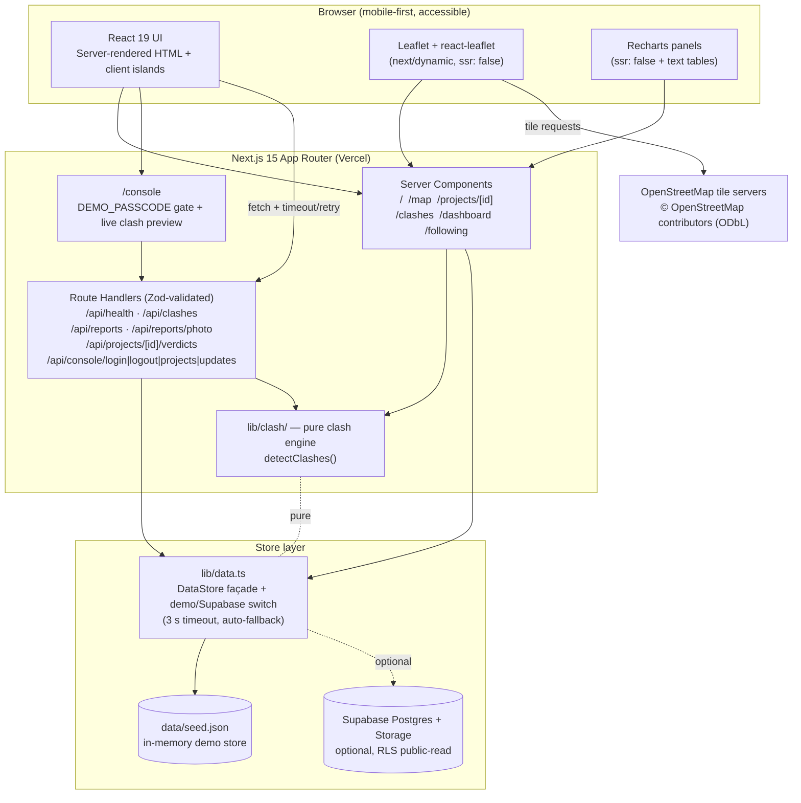

# GeoMesh — Public Works & Utility Clash Tracker

> **Simulated demo data — not real projects.** Every project, department,
> contractor, budget, clash and citizen report in this app is fictional. See
> [Demo credentials & simulated data disclosure](#7-demo-credentials--simulated-data-disclosure).

**One-liner:** GeoMesh is a public registry and coordination layer for civic
works that catches the same road being dug up twice — by flagging live
inter-departmental work clashes with a pure spatial-temporal engine, surfacing
unlisted digging through citizen reports, and scoring departments on public
delays, repeat digs and contested completions.

---

## Quick Links

| | |
| --- | --- |
| 🚀 **Live demo** | https://geomesh-app.vercel.app |
| 🎬 **Demo video** | [https://youtu.be/38Rogm0bb0U](https://youtu.be/38Rogm0bb0U) |
| 🗺️ **Repository** | [`SAINARESH-x/GeoMesh`](https://github.com/SAINARESH-x/GeoMesh) |
| 👤 **Author** | SAI NARESH P · Roll No: EC24B1038 |
| 🐙 **GitHub** | https://github.com/SAINARESH-x |
| 💼 **LinkedIn** | https://www.linkedin.com/in/sai-naresh-3a420331a |

---

## Demo Video

[▶ Watch the GeoMesh demo](https://youtu.be/38Rogm0bb0U) · https://youtu.be/38Rogm0bb0U

The walkthrough demonstrates navigation of the spatial clash engine — locating
overlapping and repeat-dig works on the map and reading each clash's severity and
coordinated-schedule proposal — followed by the citizen reporting flow, where a
geotagged issue auto-links to the nearest active project (or is flagged as
unlisted work), and closes on the admin console reviewing projects and appending
status updates behind the `DEMO_PASSCODE` gate.

---

## 1. Problem Statement & Solution

### Problem Statement

**CivicTech — Improving Transparency and Coordination in Public Works Projects.**

Residents watch the same stretch of road get dug up, patched and dug up again,
but the plan, the department, the contractor and the deadline live in separate
offices. No one can answer *what is being dug here, by whom, until when, and why
it slipped*. Worse, the departments themselves often don't know what the others
have planned, so a freshly restored road is opened again weeks later — wasting
public money and compounding traffic and safety hazards.

### Our Solution

GeoMesh gives every civic work one public record and one coordinate system, then
adds a coordination brain on top:

1. **Spatial-temporal conflict detection engine** — a pure, unit-tested module
   (`lib/clash/`) that finds two failure modes: **concurrent overlaps** (two
   departments on the same/adjacent road at once) and **repeat digs** (work
   starting within 180 days of a road being restored), scores their severity,
   and proposes a coordinated schedule that opens the road once instead of twice.
2. **Citizen-led unlisted-work reporting** — geotagged issue reports that are
   auto-linked to the nearest active project by proximity, or flagged as
   `is_unlisted_work` when no registry entry exists — the one signal with no
   official line to sit on.
3. **Public accountability scorecards** — a transparency dashboard of delays,
   repeat digs, contested "completed" jobs and a per-department scorecard.

---

## 2. Key Features & Screenshots

### Live Clash Map

One polyline per road segment with a status legend that never relies on colour
alone (glyph + line style + colour), click popups linking to the project, and
**⚠ clash badges** on flagged roads. Unlisted-work reports are pinned as their
own markers, and a keyboard-accessible text list mirrors the map.

### Citizen Reporting & Spatial Auto-linking

`/report` captures a geotagged issue (browser geolocation, a tap on the Leaflet
picker, or typed coordinates) with an optional photo. The server re-runs the same
pure proximity logic: a report within **100 m** of an active project links to it;
otherwise it becomes an **unlisted work**. Citizens can follow projects (no
account), see a "what changed since your last visit" feed, and confirm or dispute
a completion.

### Public Dashboard & Waste Metrics

Delays, repeat digs, contested completions and a sortable per-department
scorecard, with a headline **simulated** waste figure for repeat digs. Each
Recharts panel has a plain data table beside it as a text alternative.

### Admin Console (`/console`)

The department-side flow, gated by the shared `DEMO_PASSCODE`: a **New Project**
form with a **live clash preview** that re-runs the engine as you edit dates,
road and department, and an **Add Update** form that appends to a permanent
(append-only) status history — with a delay reason required once a project is
past its planned end.

### Visual Showcase (optional)

Screenshot placeholders live under `docs/images/`; drop the captures there to
render them.

| Screen | Preview |
| --- | --- |
| Live clash map & project markers |  |
| Citizen report form with geotagged location |  |
| Transparency dashboard with KPIs and department scorecard |  |
| Department console with live clash preview |  |

---

## 3. HOW THE CLASH ENGINE WORKS

The engine lives entirely in **`lib/clash/`** — a **pure** module with no UI,
database, framework or `window` imports. It is deterministic: the same registry
always yields the same board, which is what lets the API cache it and the tests
assert on it.

```
lib/clash/
├── types.ts     Vocabulary: Clash, ClashType, Severity, options, result shape
├── window.ts    Date parsing + work-window resolution
├── geo.ts       Hand-written haversine / point-to-segment / polyline distance
├── severity.ts  The documented 0–100 severity formula
├── suggest.ts   Coordination proposals (merge / batch / coordinate)
└── detect.ts    detectClashes(projects, segments, options) — the rules
```

```ts
const { clashes, clusters, skipped } = detectClashes(projects, segments, { now });
```

### Spatial buffer rules

- Two projects are **spatially related** when they share the same
  `road_segment_id`, **or** when the closest approach of their polylines is
  `<= adjacencyMeters` (**default 50 m**).
- Distances are computed in a **local metre frame** with hand-written
  **haversine** and **point-to-segment** maths (`lib/clash/geo.ts`).
  **No `turf.js` or any spatial library** is used — the maths is inspectable and
  unit-tested.
- Segment-to-segment distance is exact: if the polylines intersect it is `0`,
  otherwise the minimum is always attained at an endpoint (four point-to-segment
  calls, no iterative solver).
- Adjacency is **grid-bucketed** (one cell = one adjacency radius), so only
  segments sharing or neighbouring a cell are ever compared.

### Temporal overlap logic

- A work's window is `actual_start ?? planned_start` … `actual_end ?? planned_end`
  (real dates win over planned, field by field).
- **Concurrent overlap:** spatially related, **different departments**, and the
  two windows intersect for at least one day. Overlap is **inclusive** — a work
  ending 10 June and one starting 10 June share that day (1 day of overlap, not
  zero).
- **Repeat dig:** a strictly positive gap — `end(A) < start(B)` — of at most
  **`repeatDigWindowDays` (default 180 days)**. Overlap and repeat-dig are
  mutually exclusive, so one unordered pair yields at most one clash.
- **Cancelled** projects are excluded outright. A row with **missing**,
  **unparseable** (`2026-02-30`) or **inverted** dates (end before start) is
  reported in `skipped` with a reason — the engine **never throws**, so one bad
  row cannot blank the whole board.
- **Same-department** pairs are still reported (a sequencing mistake worth
  seeing) but forced to severity `low`, unless `ignoreSameDepartment: true`.

### Clash severity levels

Severity is a documented, reproducible **0–100 score** (`lib/clash/severity.ts`):

| Term | Range | Rule |
| --- | --- | --- |
| **time** | 0–35 | Overlap: `min(overlapDays, 60) / 60 × 35`. Repeat dig: `(1 − min(gapDays, window) / window) × 35` (shorter gap scores higher). |
| **money** | 0–25 | `min((budgetA + budgetB) / ₹50,00,000, 1) × 25`. Missing budgets contribute 0. |
| **utility** | 0–20 | `((weightA + weightB) / 2) × 20`. Weights: road `1.0`, water `0.9`, drain `0.85`, power `0.7`, fibre `0.5`. |
| **crowd** | 0–20 | `min(clusterSize, 5) / 5 × 20` — a 5-way tangle saturates; a 2-way pair scores 8. |

Bands: **`score ≥ 66 → high`**, **`score ≥ 33 → medium`**, otherwise **`low`**.

Each clash carries a plain-language **`explanation`** ("why flagged", safe for a
citizen) and a **`suggestion`** coordination proposal:

- **Overlap → merge** into one window `[min(starts), max(ends)]` — one shared
  trench, saving ~35% of the smaller budget.
- **Repeat dig → batch/merge** so the later dig is batched with the next planned
  one — saving ~60% of the smaller budget. Every rupee figure is labelled
  `(simulated estimate)`.

### Complexity & scaling

The naive shape is `O(projects²)`. Instead:

1. Projects are bucketed by `road_segment_id` in one pass.
2. Segment adjacency is computed **once**, grid-bucketed, and only for segments
   that actually carry projects.
3. Only same/adjacent-segment pairs are compared, and each segment list is
   sorted by start date so the inner loop **breaks early** once the gap exceeds
   the repeat-dig window.

The result is effectively `O(projects · neighbours)`; 3+-way conflicts are
grouped into a single cluster (stable ids, no duplicated pairs) via union-find.
A **500-project** performance test asserts the whole run stays **well under
300 ms**, and output order is deterministic (severity, then estimated waste,
then ids) — never map order.

### Test coverage in `lib/`

`npm test` runs **18 Vitest files (273 test cases)**. The engine carries the
heaviest coverage:

- **`tests/clash.test.ts`** — engine contract & defaults, severity bands and
  utility weights, geometry helpers, work-window resolution, identical- and
  adjacent-segment overlaps, non-overlapping windows, touching dates, repeat
  digs inside/at/outside the 180-day window, same-department pairs, cancelled &
  inverted rows, missing dates, empty input, a 3-way cluster with no duplicated
  pairs, determinism (order-insensitive input, stable output), the 500-project
  performance budget, and the flagship seed story (a water main followed by a
  power cable **91 days** later, plus the four-way Amber Garden Road cluster).
- **`tests/clash-view.test.ts`** — the browser-safe shared helpers and the API
  payload summary.
- **`tests/geo-link.test.ts`** — the 100 m citizen auto-link boundary.
- **`tests/contested.test.ts`** — both contest thresholds and their edges.
- Plus `data`, `console-auth`, `console-schemas`, `dashboard-metrics`,
  `image-metadata`, `rate-limit`, `filters`, `format`, `geometry`, `map-lines`,
  `follow-activity`, `follow-display`, `seed` and `seed-dates` suites.

---

## 4. Architecture & Data Model

### Architecture



**Data flow:** server components read through `lib/data.ts`, which returns
`data/seed.json` when Supabase env vars are absent or the database is
unreachable (3 s timeout, then fall back — the app keeps working). All mutations
go through Route Handlers that **re-validate every payload with the shared Zod
schemas** on both client and server. Leaflet never runs on the server — it is
loaded behind `next/dynamic` with `ssr: false`.

### Data model

Types are defined in `lib/types.ts` and mirror `supabase/schema.sql` exactly.
**Every row carries `is_simulated = true`.**

| Entity | Key fields | Notes |
| --- | --- | --- |
| **Departments** | `id`, `name`, `code`, `is_simulated` | Generic names — Roads, Water Board, Power Utility, Storm-water Drains, Telecom Fibre. |
| **Road segments** | `id`, `name`, `ward`, `geometry` (GeoJSON LineString, EPSG:4326) | Stored as `jsonb` so no PostGIS extension is required. |
| **Projects** | `id`, `title`, `purpose`, `project_type`, `department_id`, `contractor_name`, `road_segment_id`, `planned_start/end`, `actual_start/end`, `status`, `budget_inr` | Status ∈ `planned · in_progress · stalled · completed · cancelled`. Types ∈ `road · drain · water_pipeline · power_cable · fibre · other`. |
| **Project updates** | `id`, `project_id`, `status`, `note`, `delay_reason`, `new_planned_end`, `created_at` | **Append-only** audit log — never updated or deleted. |
| **Citizen reports** | `id`, `project_id` (nullable), `report_type`, `description`, `photo_url`, `lat`, `lng`, `is_unlisted_work`, `created_at` | `project_id = null` + `is_unlisted_work = true` is digging with **no registry entry**. |
| **Verifications** | `id`, `project_id`, `vote` (`confirm`/`dispute`), `device_id`, `created_at` | `unique (project_id, device_id)` — one vote per device. |
| **Clashes** | *computed, not stored* | Derived by `lib/clash/` from the registry; `GET /api/clashes` exposes the board as cacheable JSON. |

The seed dataset backing demo mode contains **5 departments, 12 road segments,
39 projects, 7 updates, 16 citizen reports and 10 verifications**, with planted,
deterministic clash scenarios (including the flagship 91-day repeat dig and a
contested completion).

---

## 5. Open-Source Libraries & Services

Versions are taken directly from `package.json`. All are **free / open source**
— no paid services are used.

| Name | Version | Purpose | License / Source |
| --- | --- | --- | --- |
| [Next.js](https://nextjs.org) | `15.5.27` | App Router framework, server components, Route Handlers, build | MIT |
| [React](https://react.dev) | `19.1.0` | UI library (`react-dom` `19.1.0`) | MIT |
| [Leaflet](https://leafletjs.com) | `^1.9.4` | Interactive map rendering | BSD-2-Clause |
| [react-leaflet](https://github.com/PaulLeCam/react-leaflet) | `^5.0.0` | React bindings for Leaflet (client-only) | MIT |
| [Recharts](https://recharts.org) | `^2.15.0` | Dashboard charts | MIT |
| [Zod](https://zod.dev) | `^3.24.1` | Shared client + server schema validation | MIT |
| [Supabase JS](https://github.com/supabase/supabase-js) | `^2.49.0` | Optional Postgres / Auth / Storage client | Apache-2.0 |
| [Tailwind CSS](https://tailwindcss.com) | `^4` | Utility-first styling (`@tailwindcss/postcss` `^4`) | MIT |
| [TypeScript](https://www.typescriptlang.org) | `^5` | Static typing | Apache-2.0 |
| [Vitest](https://vitest.dev) | `^3.0.0` | Unit test runner | MIT |
| [ESLint](https://eslint.org) + `eslint-config-next` | `^9` / `15.5.27` | Linting | MIT |
| [tsx](https://github.com/privatenumber/tsx) | `^4.23.15` | Runs the TypeScript seed script | MIT |
| **OpenStreetMap tiles** | live service | Base map tiles | © OpenStreetMap contributors, **ODbL** (attributed on the map) |
| [Vercel](https://vercel.com) | hosting | Public deployment | Free tier (hosting only) |

**Deliberately not used:** no `turf.js` (or any spatial library) — the clash
engine's distance maths is hand-written in `lib/clash/geo.ts`; no image/EXIF
library (no `sharp`, no `piexifjs`) — the browser downscales photos with a plain
`<canvas>` and `lib/image/metadata.ts` strips metadata by parsing the container
bytes by hand.

---

## 6. Setup Instructions (Clean Clone)

### Prerequisites

- **Node.js `>= 20`** (declared in `package.json` → `engines`)
- **npm** (the repo ships a `package-lock.json`)

```sh
git clone git@github.com:SAINARESH-x/GeoMesh.git
cd GeoMesh
npm install
```

### Environment variables

Copy the example file. Everything is optional — with no Supabase values the app
runs in **demo mode** off `data/seed.json`.

```sh
cp .env.example .env.local
```

| Variable | Required? | Purpose |
| --- | --- | --- |
| `DEMO_PASSCODE` | Optional | Enables `/console`. If unset, the console is disabled outright (no open fallback). |
| `NEXT_PUBLIC_SUPABASE_URL` | Optional | Supabase project URL. Blank ⇒ demo mode. |
| `NEXT_PUBLIC_SUPABASE_ANON_KEY` | Optional | Public read key. Blank ⇒ demo mode. |
| `SUPABASE_SERVICE_ROLE_KEY` | Optional | **Server-only.** Uploads report photos / bypasses RLS. Blank ⇒ placeholder photos. |
| `SUPABASE_REPORT_BUCKET` | Optional | Storage bucket name (default `report-photos`). |

To enable the demo console:

```sh
echo "DEMO_PASSCODE=geomesh-demo" >> .env.local
```

### Running
<!-- commands verified directly against package.json "scripts" -->

| Command | Runs | Purpose |
| --- | --- | --- |
| `npm run dev` | `next dev --turbopack` | Dev server at http://localhost:3000 |
| `npm run build` | `next build` | Production build |
| `npm start` | `next start` | Serve the production build |
| `npm run typecheck` | `tsc --noEmit` | Type-check |
| `npm run lint` | `eslint .` | Lint |
| `npm run test` | `vitest run` | Run the unit test suite |
| `npm run test:watch` | `vitest` | Watch mode |
| `npm run seed` | `tsx scripts/seed.ts` | Regenerate `data/seed.json` |

```sh
npm run dev        # http://localhost:3000
npm run build && npm start
npm run typecheck && npm run lint && npm run test   # full verification
```

Health check (demo mode is the default with no env vars set):

```sh
curl http://localhost:3000/api/health
# {"ok":true,"mode":"demo","timestamp":"..."}
```

### Optional: Supabase + photo storage

Demo mode needs no database at all. To persist, set the two `NEXT_PUBLIC_`
variables, run `supabase/schema.sql` (creates the tables and a public-read
`report-photos` bucket), and set `SUPABASE_SERVICE_ROLE_KEY` so the server can
upload report photos. With no service-role key the app keeps working — uploads
return the committed placeholder image.

---

## 7. Demo Credentials & Simulated Data Disclosure

### Demo credentials

| Field | Value |
| --- | --- |
| Console passcode (`DEMO_PASSCODE`) | `geomesh-demo` |

Set `DEMO_PASSCODE=geomesh-demo` (see [Setup](#6-setup-instructions-clean-clone)),
then open `/console` and enter the passcode. The gate is a server-side check with
an **httpOnly** session cookie and a 5-attempts-per-15-minutes per-IP limit.
**This is a hackathon stand-in for real authentication, not production
security.**

### Simulated data disclosure

**All project, department, contractor, budget, clash, delay and citizen-report
data in this application is SIMULATED.** Nothing here refers to a real municipal
project, department or contractor.

- Road names are fictional and department names are deliberately generic.
- Every record carries `is_simulated = true`.
- The UI shows a persistent **"Simulated demo data — not real projects"** banner
  on every screen, and `/api/health` reports which data mode the app is in.
- Cost figures produced by the clash engine are labelled **(simulated estimate)**
  wherever they appear.
- Writes made in demo mode are **in-memory** and reset when the server restarts.

**Live external data:** only the **OpenStreetMap base map tiles** are live
external data, loaded from OpenStreetMap tile servers and attributed on the map.
No other external service is queried in demo mode.

---

## 8. Real-World Feasibility, Limitations & Future Scope

### Current demo limitations

- **In-memory demo persistence.** With no Supabase configured, console writes
  (new projects, status updates) live for the lifetime of the server process and
  reset on restart. Set Supabase env vars to persist.
- **Shared passcode, not real auth.** `/console` uses one passcode + an httpOnly
  cookie instead of Supabase Auth with roles.
- **In-memory rate limiting.** Per-process only: on a multi-instance deploy the
  effective limit is `limit × instances`. An honest demo-grade guard, not a
  distributed limiter.
- **Simulated registry.** There is no live feed from any municipality yet.

### Production roadmap

- **Integration with real municipal GIS layers** — ingest road/utility geometry
  from city GIS and replace `data/seed.json` with the live registry.
- **Municipal permit APIs** — pull work permits so a new dig is checked against
  the registry *before* it is approved, and materialise clashes (e.g. PostGIS /
  GiST indexing, a nightly `clash_reports` view).
- **Automated citizen report moderation** — weighted crowd verification and a
  moderation queue for unlisted-work reports (with photo review).
- **Role-based department access** — Supabase Auth with department `admin` /
  `department` roles, RLS-backed writes and audit logs instead of a shared
  passcode.
- Further out: SMS/WhatsApp alerts on followed-project changes, field-officer
  mobile proof-of-work photos, ML delay/waste estimation, Open311 export,
  multi-city / multilingual / offline PWA.

---

## 9. Team Credits

Built during the **IIITDM Kancheepuram 24-hour hackathon**, **CivicTech** track —
*Improving Transparency and Coordination in Public Works Projects*.

**Solo author:** SAI NARESH P (Roll No: EC24B1038)

| | |
| --- | --- |
| 🐙 **GitHub** | https://github.com/SAINARESH-x |
| 💼 **LinkedIn** | https://www.linkedin.com/in/sai-naresh-3a420331a |

---

<sub>GeoMesh — hackathon demo. All projects, departments and contractors shown
here are simulated. See [simulated data disclosure](#7-demo-credentials--simulated-data-disclosure).</sub>
